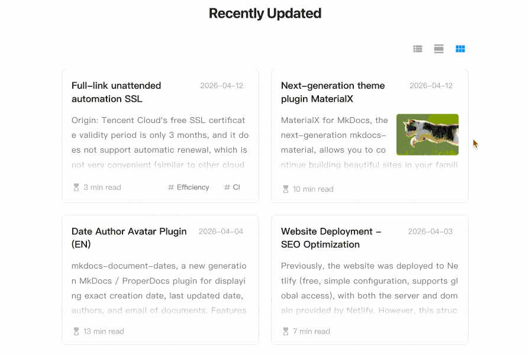

## MaterialX for MkDocs

<br />

**MaterialX**, the next generation of mkdocs-material, build beautiful sites the way you already know and love, based on `mkdocs-material-9.7.1` and named `X`, it provides ongoing maintenance and updates. (since mkdocs-material will cease maintenance)

<p align="center">
  
</p>

## What Difference

For a more detailed description of the differences, see documentation: [Why MaterialX](https://jaywhj.github.io/mkdocs-materialx/differences.html)

<br />

### Differences from Material

| Aspect              |          mkdocs-material           |                       MaterialX                   |
| ------------------- |  --------------------------------  |  -----------------------------------------------  |
| **Latest Version**  |       mkdocs-material-9.7.1        | mkdocs-materialx-10.x <br />(based on mkdocs-material-9.7.1) |
| **Usage**           | Use mkdocs.yml with the theme name `material` | Use mkdocs.yml with the new theme name `materialx`, everything else is the same as when using material |
| **Current Status**  |     Nearing end-of-maintenance     |          Active maintenance and updates           |
| **Feature Updates** |      None (with legacy bugs)       | Bug fixes, new feature additions, UX improvements,<br />see [Changelog](https://github.com/jaywhj/mkdocs-materialx/releases) |

### Differences from Zensical

| Aspect         |                    Zensical                  |                        MaterialX                  |
| -------------- | -------------------------------------------- | ------------------------------------------------- |
| **Audience**   | Technical developers <br /> Technical documentation | All markdown users <br /> Markdown notes & documents |
| **Language**   |                      Rust                   |                  Python               |
| **Stage**      | Launched a few months ago, in early stages, basic functionality incomplete | Launched for over a decade, mature and stable |
| **Usage**      | Adopt the new TOML configuration format, all configurations in the original mkdocs.yml need to be reconfigured from scratch | Continue to use mkdocs.yml with zero migration cost |
| **Ecosystem**  | Built entirely from scratch, incompatible with all original MkDocs components, future development uncertain | Based on MkDocs & mkdocs-material-9.7.1, fully compatible with MkDocs' rich long-built ecosystem, open and vibrant |
| **Core Focus** | Prioritizes technical customization, with increasingly cumbersome feature configurations and ever-growing complexity in usage | Focuses on universal functions & visual presentation, extreme ease of use as primary principle, evolving to be more lightweight |

<br />

## Key Update Highlights

- Added the modern Liquid Glass theme, consistent with Zensical
- Added the next-gen date and author plugin, see documentation: [Adding Document Dates and Authors](setup/adding-document-dates-authors.md)
- Added the recent updates module, see documentation: [Adding Recent Updates Module](setup/adding-recent-updates-module.md)
- Refactor the TOC for mobile, enabling seamless NAV and TOC experiences on mobile (Zensical has no TOC on mobile)
- Perfectly fixed the issue where swipe events would penetrate when the drawer was active on mobile (Zensical & Material failed to fix)
- Added indentation guide lines and active link accent color for TOC
- Moved the "back-to-top" container to the bottom, aligning with intuitive proximity-based interaction logic
- Allow to set topbar background color in Liquid Glass theme, see [Topbar style](setup/changing-the-colors.md#topbar-style)

## Quick Start

Installation:

``` sh
pip install mkdocs-materialx
```

Configure `materialx` theme to mkdocs.yml:

``` yaml
theme:
  name: materialx
```

> [!NOTE]
> The theme name is `materialx`, not material. Everything else is the same as when using material.

Start a live preview server with the following command for automatic open and reload:

```
mkdocs serve --livereload -o
```
<br />

For detailed installation instructions, configuration options, and a demo, visit [jaywhj.github.io/mkdocs-materialx](https://jaywhj.github.io/mkdocs-materialx/)

<br />

## Chat Group

**Discord**: https://discord.gg/cvTfge4AUy

**Wechat**: 

