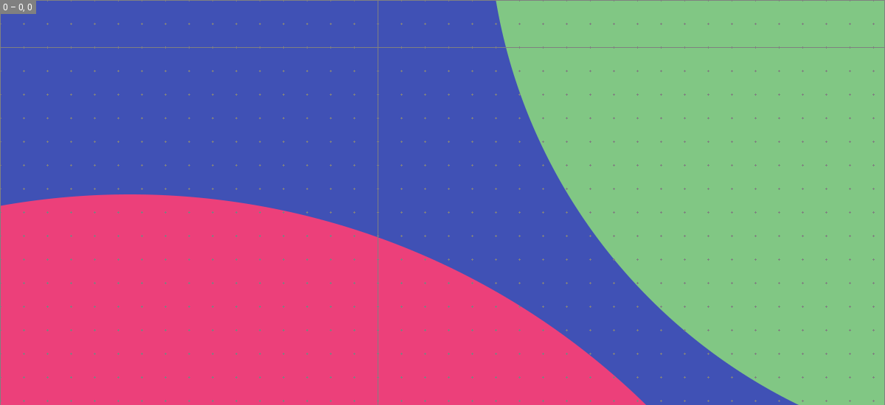

# Plugin recommendation

MkDocs boasts a rich ecosystem of plugins that can satisfy a wide range of user customization needs, this is also one of the main reasons why the MkDocs is so popular. 

[category](https://github.com/ProperDocs/catalog){target="_blank"} groups most plugins by category. Below, I will select practical ones for recommendation based on the following criteria:

- Practical and concise
- Good performance
- Actively maintained (updated within the last year)

Contributions and PRs are welcome.

## External plugins

External plugins are developed by third-party developers and require manual installation.

### Graphics & Charts

???+ tip "[mkdocs-glightbox][glightbox] - click to open the image as a lightbox"

    

???+ tip "[mkdocs-drawio][drawio] - embed interactive drawio diagrams in documents"

    === "Rendering"

        

    === "Usage"

        ```markdown
        <!-- Add a drawio file like a normal image -->
        
        
        ```

???+ tip "[mkdocs-mermaid2-plugin][mermaid2] - renders mermaid text into diagrams (built-in)"

    === "Rendering"

        ```mermaid
        %%{init: {'theme': 'default', 'themeVariables': {'fontSize': '12px'}}}%%
        flowchart LR
            A(1.Front Matter)
            B(2.Cache File)
            C(3.Git Timestamp)
            D(4.File Timestamp)
            A -.Creation date.-> B -.-> C -.-> D
            A -.Last updated.-> C
        ```

    === "Usage"

        ````
        ```mermaid
        %%{init: {'theme': 'default', 'themeVariables': {'fontSize': '12px'}}}%%
        flowchart LR
            A(1.Front Matter)
            B(2.Cache File)
            C(3.Git Timestamp)
            D(4.File Timestamp)
            A -.Creation date.-> B -.-> C -.-> D
            A -.Last updated.-> C
        ```
        ````

??? tip "[mkdocs-markmap][markmap] - create interactive mind maps from markdown and embed them in documents"

    **Usage**: use `markmap` fence blocks to enclose markdown content

    `````
    ````markmap

    ## Mind Map

    ### Fence Block Enclosure

    - That's great. Anything

    ### Formatting and Lists

    - **strong** ~~del~~ *italic* ==highlight==
    - `inline code`
    - [x] checkbox
    - Katex: $x = {-b \pm \sqrt{b^2-4ac} \over 2a}$

    ### Code block

    ```js
    for (let i = 0; i < 5; i++) {
        console.log("value", i);
    }
    ```

    ### Table block

    | Header1 | Header2 |
    | --- | --- |
    | item 1 | 1\. one<br /> 2\. two |

    ### Image

    

    ````
    `````

<style>
  svg.markmap {
    width: 100%;
    height: 360px;
  }
</style>
<script src="https://unpkg.com/markmap-autoloader/dist/index.js"></script>

<div class="markmap">
<script type="text/template">

## Mind Map

### Fence Block Enclosure

- That's great. Anything

### Formatting and Lists

- **strong** ~~del~~ *italic* ==highlight==
- `inline code`
- [x] checkbox
- Katex: $x = {-b \pm \sqrt{b^2-4ac} \over 2a}$

### Code block

```js
for (let i = 0; i < 5; i++) {
    console.log("value", i);
}
```

### Table block

| Header1 | Header2 |
| --- | --- |
| item 1 | 1\. one<br /> 2\. two |

### Image


</script>
</div>

  [glightbox]: https://github.com/blueswen/mkdocs-glightbox
  [drawio]: https://github.com/tuunit/mkdocs-drawio
  [markmap]: https://github.com/markmap/mkdocs-markmap
  [mermaid2]: https://github.com/fralau/mkdocs-mermaid2-plugin

## Built-in plugins

Built-in plugins are installed automatically along with MaterialX.

### Optimization

<div class="grid cards" markdown>

-   :material-rabbit: &nbsp; __[Built-in optimize plugin][optimize]__

    ---

    The optimize plugin automatically identifies and optimizes all media files
    that you reference in your project by using compression and conversion
    techniques.

    ---

    __Your site loads faster as smaller images are served to your users__

-   :material-connection: &nbsp; __[Built-in offline plugin][offline]__

    ---

    The offline plugin adds support for building offline-capable documentation,
    so you can distribute the [`site` directory][mkdocs.site_dir] as a `.zip`
    file that can be downloaded.

    ---

    __Your documentation can work without connectivity to the internet__

</div>

  [group]: group.md
  [offline]: offline.md
  [optimize]: optimize.md
  [privacy]: privacy.md
  [social]: social.md

### Content

<div class="grid cards" markdown>

-   :material-magnify: &nbsp; __[Built-in search plugin][search]__

    ---

    The search plugin adds a search bar to the header, allowing users to search
    the entire documentation, so it's easier for them to find what they're
    looking for.

    ---

    __Your documentation is searchable without any external services, even
    offline__

-   :material-account-clock-outline: &nbsp; __[Built-in document-dates plugin][document-dates]__

    ---

    The document-dates plugin adds date and author to your documents. It's __20-500 times faster__ than `git-authors` and  
    `git-revision-date-localized`.

    ---

    __Manual date configuration is no longer required for any feature__

-   :material-tag-text: &nbsp; __[Built-in tags plugin][tags]__

    ---

    The tags plugin adds first-class support for categorizing pages with tags,
    adding the ability to group related pages to improve the discovery of
    related content.

    ---

    __Your pages are categorized with tags, yielding additional context__

-   :material-newspaper-variant-outline: &nbsp; __[Built-in blog plugin][blog]__

    ---

    The blog plugin adds first-class support for blogging to MaterialX for
    MkDocs, either as a sidecar to your documentation or as a standalone
    installation.

    ---

    __Your blog is built with the same powerful engine as your documentation__

</div>

  [document-dates]: date-author.md
  [blog]: blog.md
  [search]: search.md
  [tags]: tags.md

### Multiple instances

Several built-in plugins have support for multiple instances, which means that
they can be used multiple times in the same configuration file, allowing to
fine-tune behavior for separate sections of your project. Currently, the
following plugins have support for multiple instances:

<div class="mdx-columns" markdown>

- [Built-in blog plugin][blog]
- [Built-in group plugin][group]
- [Built-in optimize plugin][optimize]
- [Built-in privacy plugin][privacy]
- [Built-in social plugin][social]

</div>
