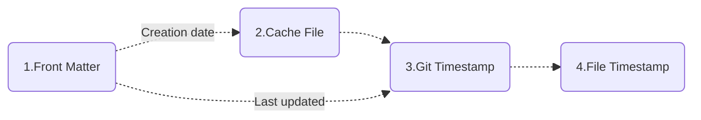
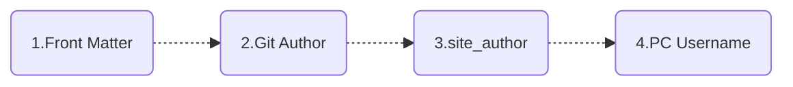
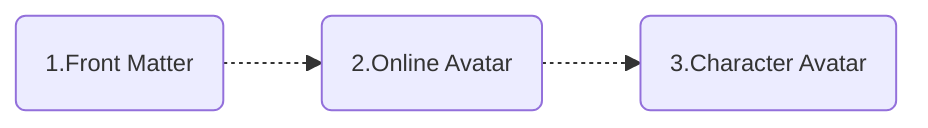

# Add document dates & authors

<!-- md:version 10.0.4 -->
<!-- md:plugin [document-dates] -->

You can add date and author information to your documents via the plugin [document-dates], a new generation MkDocs plugin for displaying exact **creation date, last updated date, authors, email** of documents.


  [document-dates]: https://github.com/jaywhj/mkdocs-document-dates

## Features

- Works in any environment (no-Git, Git environments, Docker, all CI/CD build systems, etc.)
- Support list display of recently updated documents (in descending order of update date)
- Support for manually specifying date and author in `Front Matter`
- Support for multiple date formats (date, datetime, timeago)
- Support for multiple author modes (avatar, text, hidden)
- Support for manually configuring author's name, link, avatar, email, etc.
- Flexible display position (top or bottom)
- Elegant styling (fully customizable)
- Multi-language support, localization support, intelligent recognition of user language, automatic adaptation
- **Ultimate build efficiency**: O(1), no need to set the env var `!ENV` to distinguish runs

    | Build Speed Comparison:     | 100 md: | 1000 md: | Time Complexity: |
    | --------------------------- | :-----: | :------: | :----------: |
    | git-revision-date-localized<br /><br />git-authors |  <br />＞ 3 s   |  <br />＞ 30 s   |    <br />O(n)    |
    | document-dates              | ＜ 0.1 s  | ＜ 0.15 s  |    O(1)     |

## Installation

This plugin is built-in and does not require separate installation. If you wish to install it individually, you may use the following command:

=== "Install"

    ```bash
    pip install mkdocs-document-dates
    ```

=== "Upgrade"

    ```bash
    pip install --upgrade mkdocs-document-dates
    ```

## Configuration

This plugin completely resolved date and time infrastructure issues, enabling the project to support automated date processing. Manual date configuration is no longer required for any feature, including: page date display, blog post dates, blog date archives, blog list sorting, sitemap.xml (lastmod - SEO improvements), RSS feeds, recently updated section, search ranking, and more.

!!! tip "Prerequisite"

    You need to configure it in the `plugins` section to enable it first.

Add the following lines to `mkdocs.yml`:

```yaml
plugins:
  - document-dates
```

Or, common configuration:

```yaml
plugins:
  - document-dates:
      position: top            # Display position: top(after title) bottom(end of document), default: top
      type: date               # Date type: date datetime timeago, default: date
      exclude:                 # List of excluded files (support unix shell-style wildcards)
        - temp.md                  # Example: exclude the specified file
        - blog/*                   # Example: exclude all files in blog folder, including subfolders
        - '*/index.md'             # Example: exclude all index.md files in any subfolders
```

The following configuration options are supported:

<!-- md:option document-dates.position -->

:   <!-- md:default `top` --> This option specifies the display position of the plugin. 
    Valid values are `top`, `bottom`:

    ```yaml
    plugins:
      - document-dates:
          position: top
    ```

<!-- md:option document-dates.type -->

:   <!-- md:default `date` --> This option specifies the type of date to be displayed.
    Valid values are `date`, `datetime`, `timeago`:

    ```yaml
    plugins:
      - document-dates:
          type: date
    ```

<!-- md:option document-dates.exclude -->

:   <!-- md:default none --> This option specifies a list of excluded files, supporting unix shell-style wildcards,  such as `*`, `?`, `[]` etc:

    ```yaml
    plugins:
      - document-dates:
          exclude:
            - temp.md       # Example: exclude the specified file
            - blog/*        # Example: exclude all files in blog folder, including subfolders
            - '*/index.md'  # Example: exclude all index.md files in any subfolders
    ```

<!-- md:option document-dates.date_format -->

:   <!-- md:default `%Y-%m-%d` --> This option specifies the date formatting string:

    ```yaml
    plugins:
      - document-dates:
          date_format: '%Y-%m-%d'   # e.g., %Y-%m-%d, %b %d, %Y
          time_format: '%H:%M:%S'   # valid only if type=datetime
    ```
  
  <!-- md:option document-dates.show_created -->

:   <!-- md:default `true` --> This option specifies whether to display the creation date.
    Valid values are `true`, `false`:

    ```yaml
    plugins:
      - document-dates:
          show_created: true
    ```

<!-- md:option document-dates.show_updated -->

:   <!-- md:default `true` --> This option specifies whether to display the last updated date.
    Valid values are `true`, `false`:

    ```yaml
    plugins:
      - document-dates:
          show_updated: true
    ```

<!-- md:option document-dates.show_author -->

:   <!-- md:default `true` --> This option specifies the type of author display.
    Valid values are `true`(avatar), `false`(hidden), `text`(text):

    ```yaml
    plugins:
      - document-dates:
          show_author: true   # true(avatar) text(text) false(hidden)
    ```

  [document-dates]: https://github.com/jaywhj/mkdocs-document-dates

## Settings

The plugin provides a wide range of customization options to meet various personalized needs.

### Date & Time

The date data is retrieved using a combination of different methods to adapt to various runtime environments, including no-Git environments, Git, Docker containers, and all CI/CD build systems:

- Uses **filesystem timestamps** to ensure accurate original dates in local no-Git environments
- Uses **Git timestamps** to ensure relatively accurate dates in Git environments
- Uses **cache files** to ensure accurate original dates in Git environments
- Front Matter: Manually specify the date in Front Matter if you prefer not to use automatic dates

??? quote "Why not use filesystem timestamps in Git environments?"

    Because files are recreated during git checkout or git clone, causing the original timestamps of branches/files to be lost after cloning or checking out.

#### Loading order

By default, the plugin will **automatically load** the document's "creation date" and "last updated date" in the following order.



<!--
- [x] Creation date: `Front Matter` > `Cache File` > `Git Timestamp` > `File Timestamp`
- [x] Last updated: `Front Matter` > `Git Timestamp` > `File Timestamp`
-->

!!! quote ""

    === "Creation date"

        1. Prioritize reading the custom creation date in Front Matter
        2. Then read the creation date in the cache file
        3. Next read the document’s first git commit date as the creation date
        4. Finally read the file’s creation time
    
    === "Last updated"

        1. Prioritize reading the custom last updated date in Front Matter
        2. Then read the document’s last git commit date as the last updated date
        3. Finally read the file’s modification time

#### Customization

This can be specified in Front Matter using the following fields:

- Creation date: `created`, `date`
- Last updated: `updated`, `modified`

```yaml
---
created: 2023-01-01
updated: 2025-02-23
---
```

#### Cache creation date

In the Git environment, the plugin reads the document's "first git commit date" as the creation date by default. However, if you need to retrieve the original creation date of the document (earlier than the first git commit), you can manually install Git hooks to use a caching mechanism to solve this issue. Navigate to the target repository directory in the terminal and execute the following command to install Git hooks:

```
mdd-hooks
```

> This command installs the pre-commit hook locally in the root directory of the target repository, located at `.githooks/pre-commit`.

Afterwards, every time you execute `git commit`, the cache file containing the creation date will be automatically generated (hidden by default) in the docs directory, and this cache file will also be committed automatically.

- `docs/.dates_cache.jsonl`, cache file
- `docs/.gitattributes`, merge mechanism for cache file

This method is compatible with CI/CD build systems, which will automatically detect and load the cache file.

#### Configure git fetch depth

In the CI/CD system, if the "creation date" uses the "first git commit date" (i.e., no custom or cache file date), you need to configure `git fetch depth` in the CI system to retrieve the correct first git commit record. For example:

```yaml hl_lines="6 7" title=".github/workflows/ci.yaml"
jobs:
  deploy:
    runs-on: ubuntu-latest
    steps:
      - uses: actions/checkout@v4
        with:
          fetch-depth: 0
```

!!! quote ""

    - **Github** Actions: set `fetch-depth` to `0` ([docs](https://github.com/actions/checkout))
    - **Gitlab** Runners: set `GIT_DEPTH` to `0` ([docs](https://docs.gitlab.com/ee/ci/pipelines/settings.html#limit-the-number-of-changes-fetched-during-clone))
    - **Bitbucket** pipelines: set `clone: depth: full` ([docs](https://support.atlassian.com/bitbucket-cloud/docs/configure-bitbucket-pipelinesyml/))
    - **Azure** Devops pipelines: set `Agent.Source.Git.ShallowFetchDepth` to something very high like `10e99` ([docs](https://docs.microsoft.com/en-us/azure/devops/pipelines/repos/pipeline-options-for-git?view=azure-devops#shallow-fetch))

### Author

#### Loading order

The plugin will **automatically** loads the author information of the document in the following order, and will automatically parse the email and then do the linking.



<!--
- [x] `Front Matter` > `Git Author` > `site_author(mkdocs.yml)` > `PC Username`
-->

!!! quote ""

    === "Description"
    
        1. Prioritize reading custom authors in Front Matter
        2. Then read the Git author
        3. Next read the site_author in mkdocs.yml
        4. Finally read the PC username

#### Customization

Can be configured in Front Matter in the following ways:

1) Configure a simple author: via field `name`

```yaml
---
name: any-name
email: e-name@gmail.com
---
```

2) Configure one or more authors: via field `authors`

```yaml
---
authors:
  - jaywhj
  - dawang
  - sunny
---
```

#### Enhanced author configuration

For a better user experience, you can add full configuration for all authors. To do so, create an `authors.yml` file in the `docs/` folder using the format below:

```yaml title="docs/authors.yml"
authors:
  jaywhj:
    name: Aaron Wang
    avatar: https://xxx.com/avatar.jpg
    url: https://jaywhj.netlify.app/
    email: junewhj@qq.com
    description: Minimalism
  user2:
    name: xxx
    avatar: assets/avatar.png
    url: https://xxx.com
    email: xxx@gmail.com
    description: xxx
```

When the author name in `Front Matter`, `Git Author`, `site_author(mkdocs.yml)` matches the key in `authors`, the full author information of the key will be automatically loaded.

#### Git author aggregation

Git author support account aggregation, i.e. multiple different email accounts for the same person can be aggregated to show the same author, which can be configured by providing a `.mailmap` file in the repository root directory, this is also a feature of Git itself, see [gitmailmap](https://git-scm.com/docs/gitmailmap) for more details.

The following example unifies my other Git accounts and displays them as `Aaron <junewhj@qq.com>`:

```yaml title=".mailmap"
Aaron <junewhj@qq.com> <aaron@gmail.com>
Aaron <junewhj@qq.com> <aaron@AarondeMacBook-Pro.local>
Aaron <junewhj@qq.com> aaron <aaronwqt@icloud.com>
```

### Avatar

#### Loading order

The plugin will **automatically** loads the author avatar in the following order.



<!--
- [x] `Front Matter` > `Online Avatar` > `Character Avatar`
-->

#### Customization 

Customizable via `avatar` field in [Enhanced author configuration](#enhanced-author-configuration) (supports URL paths and local file paths).

#### Other avatars

!!! quote ""

    === "Online avatar"

        Load from Gravatar or Weavatar based on Git's `user.email`

    === "Character avatar"

        Automatically generated based on the author's name with the following rules:
        1. Extract initials: English takes the combination of initials, other languages take the first character
        2. Generate dynamic background color: Generate HSL color based on the hash of the name

### Structure and Style

You can configure the display structure of the plugin in the following ways in either mkdocs.yml or Front Matter.

#### Configuration structure

**Global Toggle**, configured in mkdocs.yml:

```yaml title="mkdocs.yml"
plugins:
  - document-dates:
      ...
      show_created: true    # Show creation date: true false, default: true
      show_updated: true    # Show last updated date: true false, default: true
      show_author: true     # Show author: true(avatar) text(text) false(hidden), default: true 
```

**Local Toggle**, configured in Front Matter (using the same field names):

```yaml
---
show_created: true
show_updated: true
show_author: text
---
```

!!! tip "Note"

    When used in combination, the global toggle acts as the master switch, and the local toggle only takes effect when the master switch is enabled. This does not follow the logic of local configurations overriding global ones.

#### Configuration style

You can quickly set the plugin styles through preset entrances, such as **icons, themes, colors, fonts, animations, dividing line** and so on, you just need to find the file below and uncomment it:

|        Category:        | Location:                  |
| :----------------------: | -------------------------- |
|     **Style & Theme**     | docs/assets/document_dates/user.config.css |
| **Properties & Functions** | docs/assets/document_dates/user.config.js |

You can also refer to the latest example file for free customization: [user.config](https://github.com/jaywhj/mkdocs-document-dates/tree/main/mkdocs_document_dates/static/config)

### Template Variables

You can use these variables in any template or plugin to access document metadata:

- page.meta.document_dates.dates.created
- page.meta.document_dates.dates.updated
- page.meta.document_dates.authors
- config.extra.recently_updated_docs

#### Set correct `lastmod` for sitemap

You can set the correct `lastmod` for your site's `sitemap.xml` with the template variable `document_dates.dates.updated` so that search engines can better handle SEO and thus increase your site's exposure

Step: Download the sample template [sitemap.xml](https://github.com/jaywhj/mkdocs-document-dates/blob/main/templates/overrides/sitemap.xml), and override this path `docs/overrides/sitemap.xml`

#### Recustomize plugin

The plugin can be re-customized using templates, you have full control over the rendering logic and the plugin is only responsible for providing the data

Step: Download the sample template [source-file.html](https://github.com/jaywhj/mkdocs-document-dates/blob/main/templates/overrides/partials/source-file.html), and override this path `docs/overrides/partials/source-file.html`, then freely customize the template code

### Recently Updated Module

The recent updates module displays site documentation information in a structured way, which is ideal for sites with **a large number of documents or frequent updates**, allowing readers to **quickly see what's new**.


You can get the recently updated document data (in descending order of update date) in any template via the variable `config.extra.recently_updated_docs`, then customize the rendering logic yourself.

Or just use the preset template:

- Display recently updated documents in descending order by update time, list items are dynamically updated
- Support multiple view modes including list, detail and grid
- Support automatic extraction of article summaries, no manual configuration required
- Support for customizing article cover in Front Matter

#### Config switch

First, configure the switch of `recently-updated` in `mkdocs.yml`:

```yaml title="mkdocs.yml"
- document-dates:
    ...
    recently-updated:
      limit: 10        # Limit the number of docs displayed
      exclude:         # Exclude documents you don't want to show (support unix shell-style wildcards)
        - index.md
        - blog/*
```

#### Add to sidebar navigation

Download the sample template [nav.html](https://github.com/jaywhj/mkdocs-document-dates/blob/main/templates/overrides/partials/nav.html), and override this path `docs/overrides/partials/nav.html`

#### Add anywhere in document

Insert this line anywhere in your document:

```yaml
<!-- RECENTLY_UPDATED_DOCS -->
```

#### Configure article cover

You can specify an article cover in Front Matter using the field `cover` (supports URL paths and local file paths):

```yaml
---
cover: assets/cat.jpg
---
```

#### Summary Line Configuration

The plugin intelligently parses article content and simply refine the summary without manual configuration. The number of summary lines can be configured separately for **grid** and **detail** views:

```yaml hl_lines="9-11"
plugins:

  - document-dates:
      type: timeago
      exclude: ['index.md', '*/index.md', 'blog/*']
      recently-updated:
        limit: 10
        exclude: ['index.md', 'tags.md', '*/index.md', 'blog/*']
        summary_lines:
          grid: 4
          detail: 6
```

#### Reading Time Estimation

The plugin intelligently analyzes article content, extracts valid information, and estimates readtime. It supports all major languages and mixed-language content:

- CJK languages: Chinese, Japanese, Korean
- Space-delimited languages: English, Spanish, French, German, Portuguese, Russian ...

Calculation Rules:

| Valid Element | Calculation Method | Notes |
| --- | --- | --- |
| CJK languages | 480 characters / min | Based on common industry standards |
| Space-delimited languages | 240 words / min | Based on common industry standards |
| Tables | 2s / row | Simple row-based estimation for variable-length content |
| Fence blocks | 1s / row | Includes code blocks, text blocks, YAML blocks, etc. |
| Math blocks | 4s / block | Rough estimation based on individual blocks |
| Images | 2s / image | Typical for blog post images: 2~3 seconds per image |
| Front Matter | Skipped | Generally not visible after rendering |
| HTML blocks | Skipped | Images inside HTML are counted, other content ignored (Markdown-focused) |
| Quotes & links | Skipped | Link text for href is generally not visible after rendering |
| Other invalid characters | Skipped | For example, whitespace, blank lines, special symbols, markup characters, etc. |


!!! tip "Estimation Rule Notes"

    These rules cannot fully account for individual reading habits—reading speed varies by person, language, and content type. This is only a rough estimate designed to suit most users as closely as possible.

    That said, this is still the most full-featured Markdown readtime parser I have seen publicly available. It supports all major languages while maintaining extremely high parsing performance. By comparison, readtime implementations in the mkdocs-material blog only perform simple word and image counting with no special handling for Markdown content. Its image readtime rules are also highly unreasonable (starting at 12 seconds per image and decreasing), and it does not support CJK languages.

    To avoid discouraging clicks with overly long estimated times, the default values in this calculation logic are set conservatively.

### Localization Language

The plugin's `tooltip` and `timeago` have built-in multi-language support, and the `locale` is automatically detected, so you don't need to configure it manually. If any language is missing, you can add it for them.

#### For tooltip

Built-in locales: `en zh zh_TW es fr de ar ja ko ru nl pt`

Addition Method (choose one): 

- In `user.config.js`, refer to [Part 3](https://github.com/jaywhj/mkdocs-document-dates/blob/main/mkdocs_document_dates/static/config/user.config.js) to add it by registering yourself
- Submit a PR for Inclusion

#### For timeago

When `type: timeago` is set, the timeago.js library is enabled for dynamic time rendering. The built-in locales in `timeago.min.js` only include `en zh`. If you need to load other languages, you can configure it as described below (choose one):

- In `user.config.js`, refer to [Part 2](https://github.com/jaywhj/mkdocs-document-dates/blob/main/mkdocs_document_dates/static/config/user.config.js) to add it by registering yourself
- In `mkdocs.yml`, configure the full version of `timeago.full.min.js` to reload [all locales](https://github.com/hustcc/timeago.js/tree/master/src/lang)
  ```yaml title="mkdocs.yml"
  extra_javascript:
    - assets/document_dates/core/timeago.full.min.js
  ```
